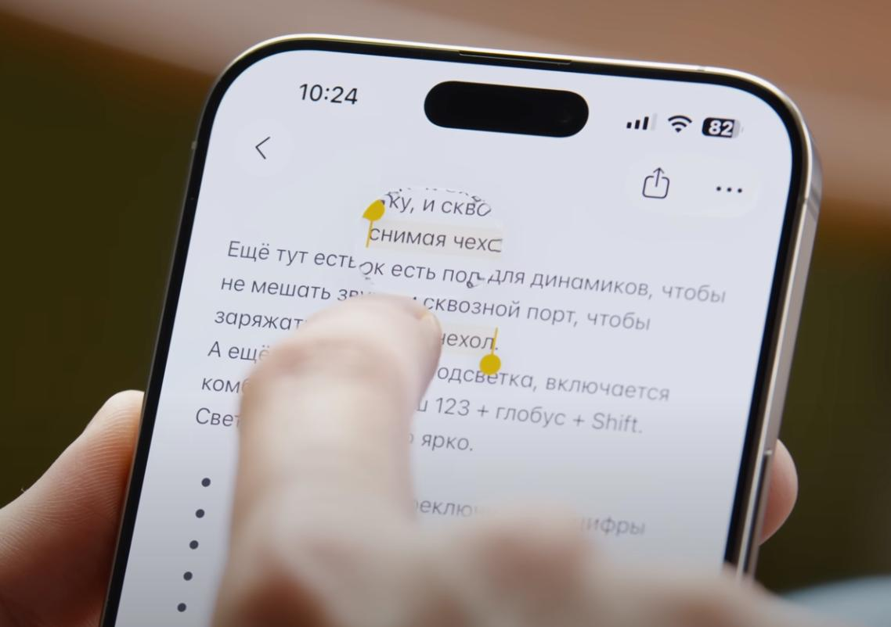
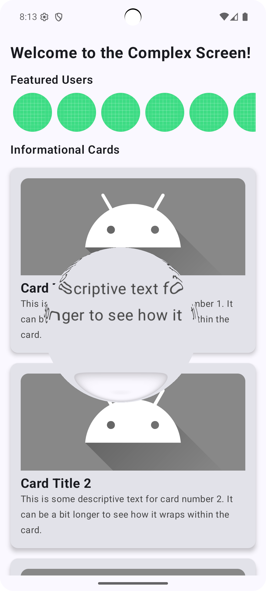

# iOS 26-style lens magnifier Liquid Glass Effect – Fish-Eye Lens Demo (Jetpack Compose + AGSL)

This project demonstrates the use of a custom AGSL (Android Graphics Shading Language) shader in Jetpack Compose to create a fish-eye lens (magnifier) effect with realistic lens refraction—**inspired by the iOS 26-style lens magnifier**.

## What This Sample Shows

- The entire scene is wrapped in a special layer with a custom AGSL shader effect.
- Inside a circular region (the lens), the image is magnified and exhibits realistic refraction, just like looking through a physical glass lens.
- The center of the lens follows your finger: simply touch and drag anywhere on the screen!
- The lens radius is set in code, but can be easily made dynamic.
- Outside the lens, the content appears unchanged.

> This sample visually imitates the lens magnification and refraction effect from iOS 26.

## Technologies Used

- Jetpack Compose (UI)
- Android RuntimeShader (AGSL)
- Custom RenderEffect (applies the shader to any Composable layer)

## How It Works

1. The project includes an AGSL shader that implements a circular magnifying glass with non-linear edge distortion.
2. The effect layer listens for touch input, so the lens center follows your finger.
3. Inside the lens, the image is zoomed and refracted; outside, the content is unchanged.

## Quick Start

- Open the project in Android Studio (API 33+ required)
- Run on a device or emulator
- Interact: Drag your finger across the screen to move the lens and watch the iOS 26-style magnifier in action!

---

> Notes:
> - All effect parameters (radius, distortion strength, zoom) can be tweaked in code.
> - The lens effect works over any content—cards, images, lists, etc.

---

## Screenshots

| IOS 26                       | Compose                  | Demo                 |
|------------------------------|--------------------------|----------------------|
|  |  |  |

---

## Authors

AGSL shader and Compose integration: *Alexander Topilskii* and my friend *GPT 4.1* 